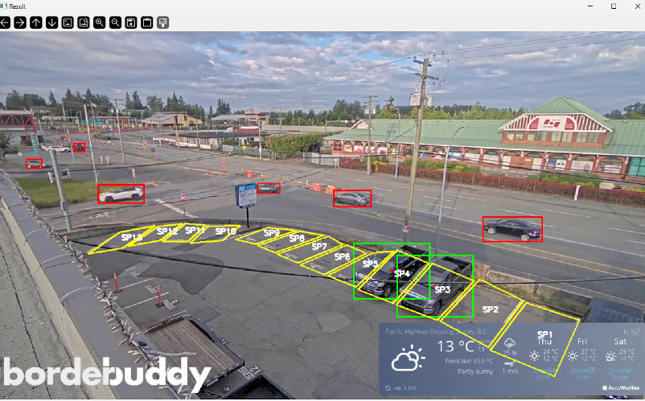
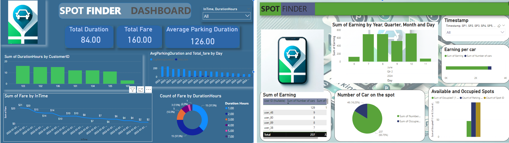
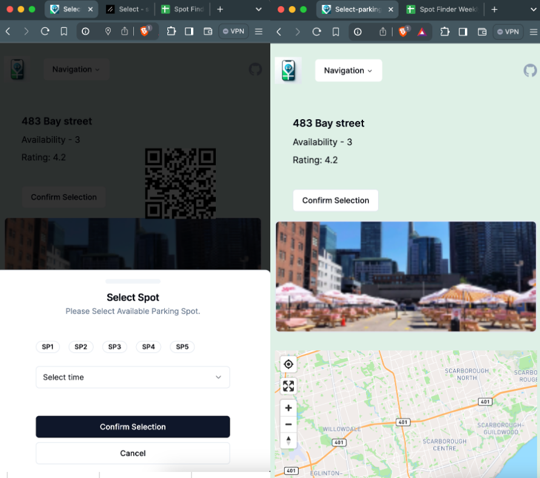

# Spot Finder

Our goal is to make parking more accessible, convenient, and sustainable for everyone. Spot Finder aims to solve the problem of underutilized parking lots by providing data-driven solutions. Spot Finder will help individuals and businesses optimize their parking spaces, reducing congestion and increasing efficiency.

## Project Overview

Spot Finder is a comprehensive solution that integrates computer vision and machine learning to detect empty parking spots and provide real-time updates to users. Our system includes both a server and frontend application to deliver a seamless user experience.

### Key Features
- **Real-time Parking Detection**: Utilizing advanced computer vision techniques to identify available parking spots.
- **User-Friendly Dashboard**: Visual representation of parking data for easy understanding and decision-making.
- **Interactive Mobile App**: Allows users to find and book parking spots quickly and efficiently.

## Visual Demonstrations

### Real-time Parking Detection

Our system accurately detects empty parking spots and highlights them for easy identification.

### User Dashboard

The dashboard provides a comprehensive overview of parking data including duration, fare, and parking patterns.

### Mobile App Interface

- Our mobile app offers a user-friendly interface to find and book parking spots.
- Users can select available parking spots and confirm their booking through the app.

### Technologies Used
- Python
- Flask
- TensorFlow
- OpenCV
- React
- Redux
- Material-UI
- React Native

### Tech Stack

- `React` (Typescript): A popular Javascript library for building user interfaces.
- `Next.js` (A react framework for server-side rendering and generating static websites.)
- `node.js` (version 18+ required JavaScript runtime for server-side development [node.js](https://nodejs.org/en))
- `yarn/npm` (Package manager to handle dependencies)

## Getting Started

### Prerequisites

Ensure you have the following installed on your development environment:

- Node.js (version 18 or above)
- `yarn` or `npm` package manager

### Installation

Clone the repository and install the dependencies:

```bash
> git clone https://github.com/amainnain122/spot-finder.git
> cd spot-finder
> cd client # where the fontend project is located
> yarn install # install packages
```

### Running the Application Locally

Start the local development server

```bash
> yarn dev # run the app
```

## Running the Application via Docker

```bash
> bash run.sh # or
> docker build -t spot-finder-app:1.0 . # buld app
> docker image ls # list images
> docker run -d -p 3001:3001 --name spot-finder spot-finder-app:1.0
> docker image prune -a --filter "until=24h" -f # clear images
```

## Project Folder Structure

```bash
├── public
├── src
   ├── app <- All the pages and app config
   ├── assets <- Images, Fonts used in the project
   ├── atoms <- reusable UI
   ├── compponent <- Reusable components
   ├── components <- Reusable components from shadcn UI
   ├── data <- mock or dummy data
   ├── lib <- Contains helper function and API connections
├── index.html <- Entry Point
├── README.md <- Developer Documentation
├── package.json <- list of library used

```

### Deployment

The project is deployed on vercel. You can access the web application here [Web App Link](https://spot-find.vercel.app)
